# Workflows

One diagram per feature and per money movement, as source for Miro boards. Each says which phase it belongs to (D41: the MVP is find, book and pay per session) and which user story or decision it comes from. Diagrams are Mermaid, which GitHub renders.

Planned Miro boards: **1. Member app**, **2. Host app**, **3. Money**, **4. Later phases**.

## Board 1: Member app (MVP)

### 1.1 Find my club, the three-question quiz (US-01)

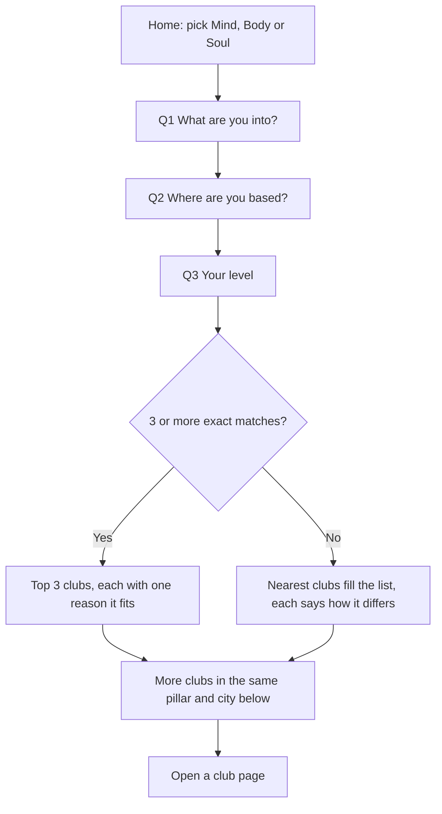
```mermaid
flowchart TD
    A[Home: pick Mind, Body or Soul] --> B[Q1 What are you into?]
    B --> C[Q2 Where are you based?]
    C --> D[Q3 Your level]
    D --> E{3 or more exact matches?}
    E -- Yes --> F[Top 3 clubs, each with one reason it fits]
    E -- No --> G[Nearest clubs fill the list, each says how it differs]
    F --> H[More clubs in the same pillar and city below]
    G --> H
    H --> I[Open a club page]
```

No account is needed to see results.

### 1.2 Browse and filter (US-02)

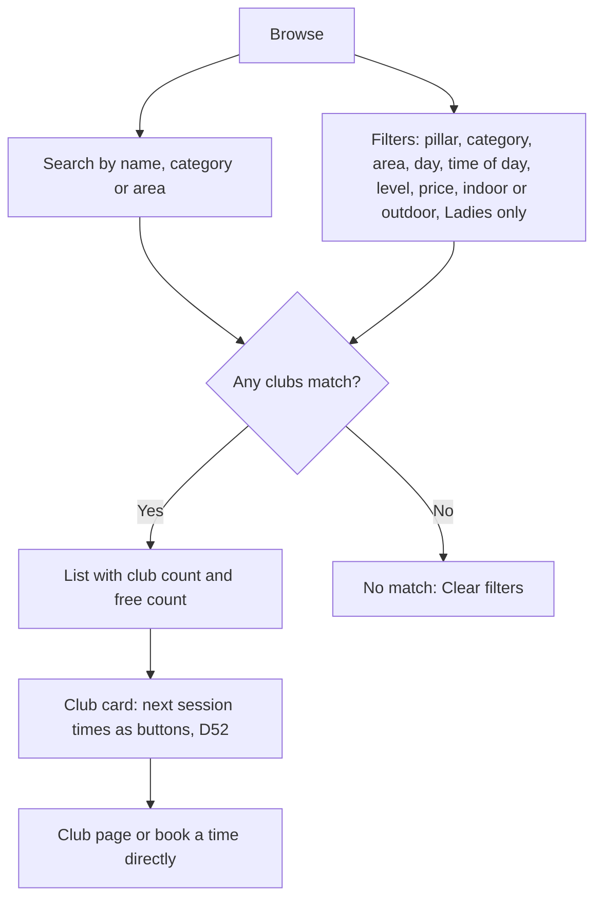
```mermaid
flowchart TD
    A[Browse] --> B[Search by name, category or area]
    A --> C[Filters: pillar, category, area, day, time of day, level, price, indoor or outdoor, Ladies only]
    B --> D{Any clubs match?}
    C --> D
    D -- Yes --> E[List with club count and free count]
    D -- No --> F[No match: Clear filters]
    E --> G[Club card: next session times as buttons, D52]
    G --> H[Club page or book a time directly]
```

### 1.3 Club page (US-03, D45)

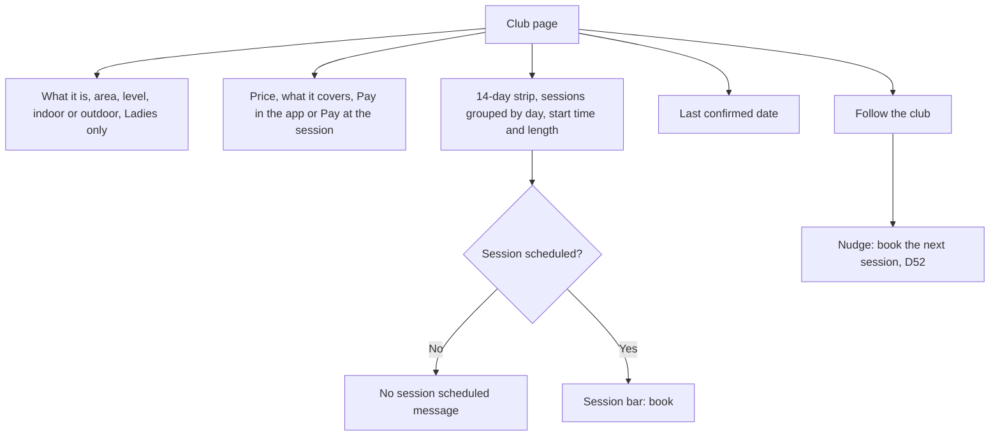
```mermaid
flowchart TD
    A[Club page] --> B[What it is, area, level, indoor or outdoor, Ladies only]
    A --> C[Price, what it covers, Pay in the app or Pay at the session]
    A --> D[14-day strip, sessions grouped by day, start time and length]
    A --> E[Last confirmed date]
    D --> F{Session scheduled?}
    F -- No --> G[No session scheduled message]
    F -- Yes --> H[Session bar: book]
    A --> I[Follow the club]
    I --> J[Nudge: book the next session, D52]
```

### 1.4 Book a free session (US-04)

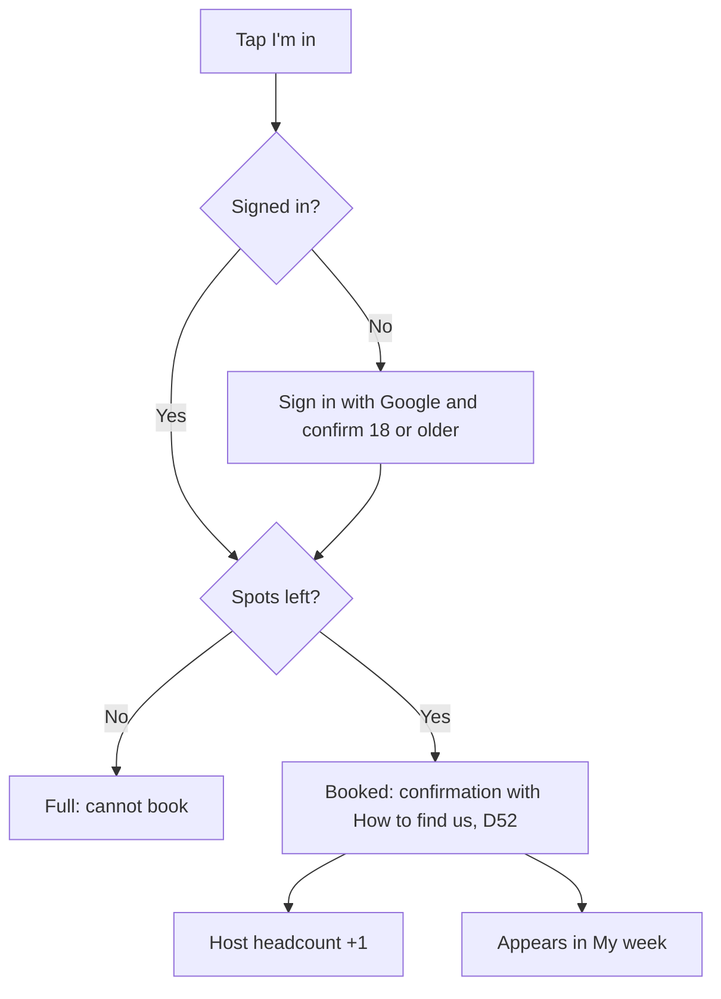
```mermaid
flowchart TD
    A[Tap I'm in] --> B{Signed in?}
    B -- No --> C[Sign in with Google and confirm 18 or older]
    B -- Yes --> D{Spots left?}
    C --> D
    D -- No --> E[Full: cannot book]
    D -- Yes --> F[Booked: confirmation with How to find us, D52]
    F --> G[Host headcount +1]
    F --> H[Appears in My week]
```

### 1.5 Book and pay for a paid session (US-05)

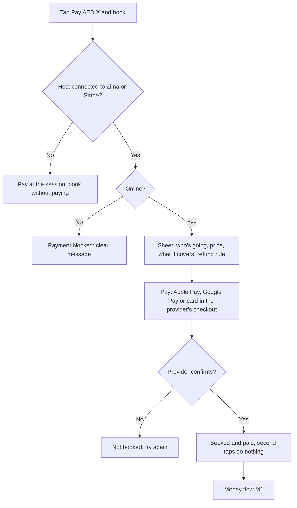
```mermaid
flowchart TD
    A[Tap Pay AED X and book] --> B{Host connected to Ziina or Stripe?}
    B -- No --> C[Pay at the session: book without paying]
    B -- Yes --> D{Online?}
    D -- No --> E[Payment blocked: clear message]
    D -- Yes --> F[Sheet: who's going, price, what it covers, refund rule]
    F --> G[Pay: Apple Pay, Google Pay or card in the provider's checkout]
    G --> H{Provider confirms?}
    H -- No --> I[Not booked: try again]
    H -- Yes --> J[Booked and paid; second taps do nothing]
    J --> K[Money flow M1]
```

### 1.6 Cancel a booking (US-04, US-06)

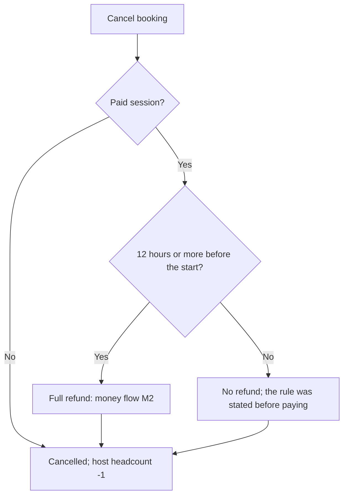
```mermaid
flowchart TD
    A[Cancel booking] --> B{Paid session?}
    B -- No --> C[Cancelled; host headcount -1]
    B -- Yes --> D{12 hours or more before the start?}
    D -- Yes --> E[Full refund: money flow M2]
    D -- No --> F[No refund; the rule was stated before paying]
    E --> C
    F --> C
```

### 1.7 My week (US-07)

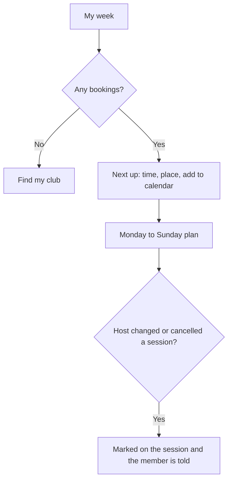
```mermaid
flowchart TD
    A[My week] --> B{Any bookings?}
    B -- No --> C[Find my club]
    B -- Yes --> D[Next up: time, place, add to calendar]
    D --> E[Monday to Sunday plan]
    E --> F{Host changed or cancelled a session?}
    F -- Yes --> G[Marked on the session and the member is told]
```

### 1.8 Reminders (US-08, D27)

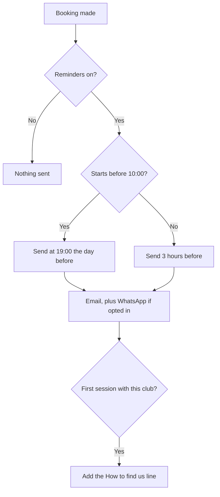
```mermaid
flowchart TD
    A[Booking made] --> B{Reminders on?}
    B -- No --> Z[Nothing sent]
    B -- Yes --> C{Starts before 10:00?}
    C -- Yes --> D[Send at 19:00 the day before]
    C -- No --> E[Send 3 hours before]
    D --> F[Email, plus WhatsApp if opted in]
    E --> F
    F --> G{First session with this club?}
    G -- Yes --> H[Add the How to find us line]
```

### 1.9 Home's top clubs (US-09, D43)

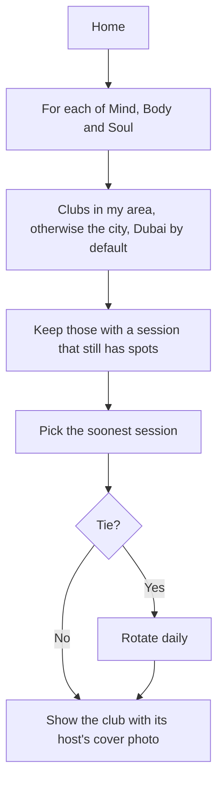
```mermaid
flowchart TD
    A[Home] --> B[For each of Mind, Body and Soul]
    B --> C[Clubs in my area, otherwise the city, Dubai by default]
    C --> D[Keep those with a session that still has spots]
    D --> E[Pick the soonest session]
    E --> F{Tie?}
    F -- Yes --> G[Rotate daily]
    F -- No --> H[Show the club with its host's cover photo]
    G --> H
```

No paid placement.

### 1.10 Delete my account (US-10)

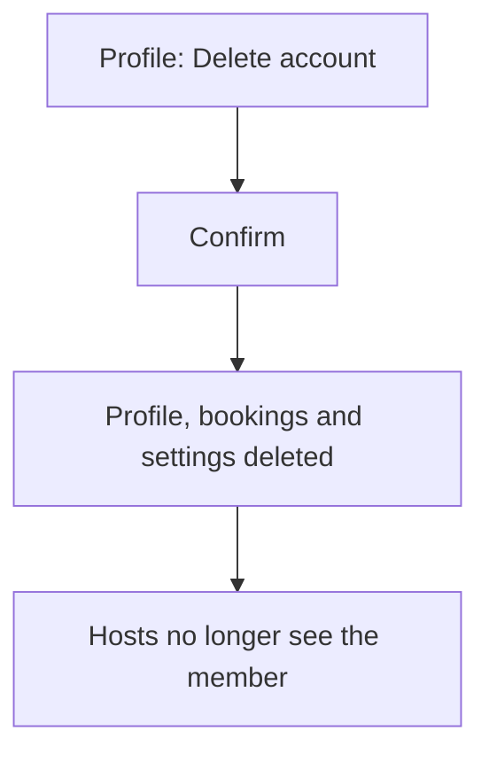
```mermaid
flowchart TD
    A[Profile: Delete account] --> B[Confirm]
    B --> C[Profile, bookings and settings deleted]
    C --> D[Hosts no longer see the member]
```

## Board 2: Host app (MVP)

### 2.1 Claim a club page (US-11, D18)

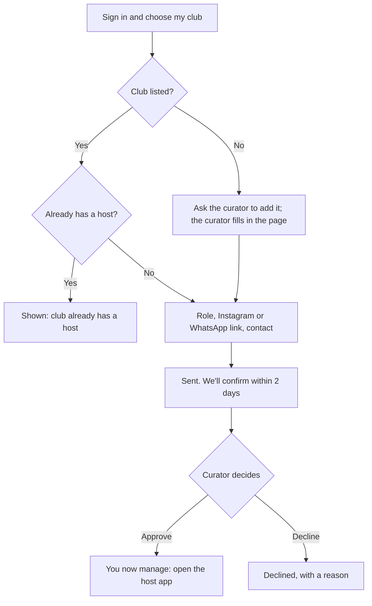
```mermaid
flowchart TD
    A[Sign in and choose my club] --> B{Club listed?}
    B -- No --> C[Ask the curator to add it; the curator fills in the page]
    B -- Yes --> D{Already has a host?}
    D -- Yes --> E[Shown: club already has a host]
    D -- No --> F[Role, Instagram or WhatsApp link, contact]
    C --> F
    F --> G[Sent. We'll confirm within 2 days]
    G --> H{Curator decides}
    H -- Approve --> I[You now manage: open the host app]
    H -- Decline --> J[Declined, with a reason]
```

### 2.2 Check the pre-filled page (US-12, D32)

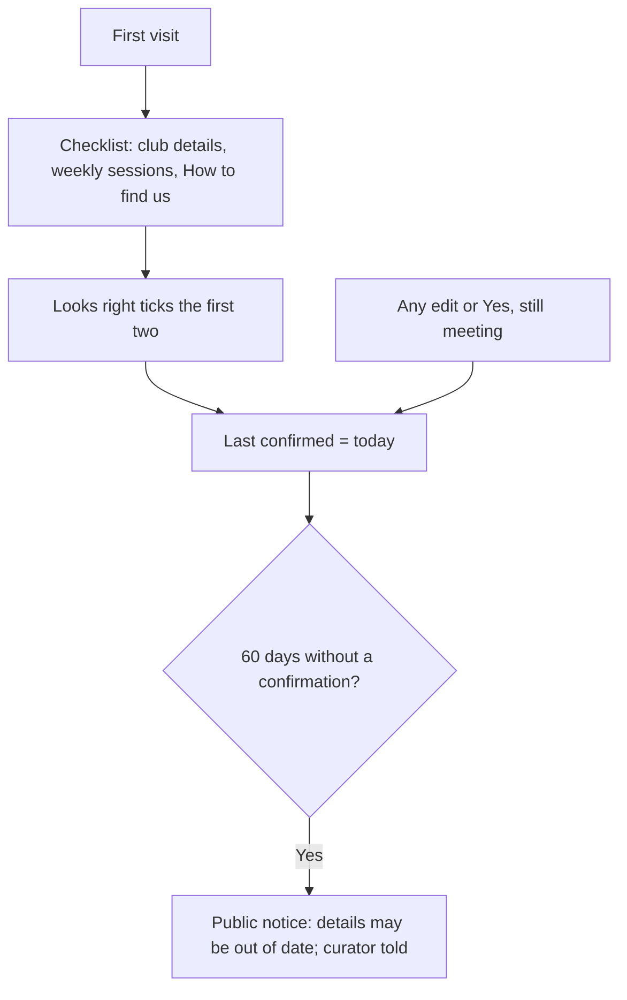
```mermaid
flowchart TD
    A[First visit] --> B[Checklist: club details, weekly sessions, How to find us]
    B --> C[Looks right ticks the first two]
    C --> D[Last confirmed = today]
    E[Any edit or Yes, still meeting] --> D
    D --> F{60 days without a confirmation?}
    F -- Yes --> G[Public notice: details may be out of date; curator told]
```

### 2.3 Manage sessions (US-13, D42)

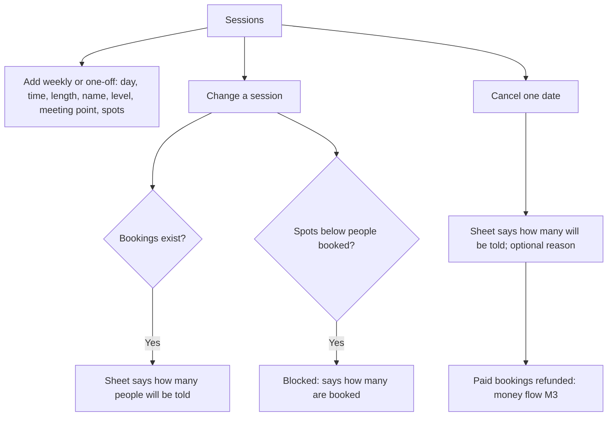
```mermaid
flowchart TD
    A[Sessions] --> B[Add weekly or one-off: day, time, length, name, level, meeting point, spots]
    A --> C[Change a session]
    A --> D[Cancel one date]
    C --> E{Bookings exist?}
    E -- Yes --> F[Sheet says how many people will be told]
    C --> G{Spots below people booked?}
    G -- Yes --> H[Blocked: says how many are booked]
    D --> I[Sheet says how many will be told; optional reason]
    I --> J[Paid bookings refunded: money flow M3]
```

### 2.4 This week (US-14)

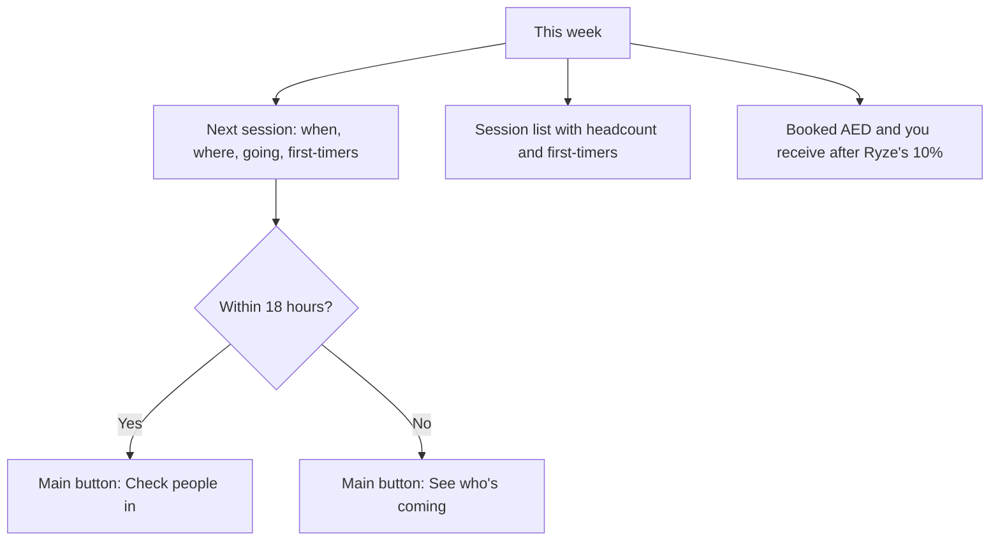
```mermaid
flowchart TD
    A[This week] --> B[Next session: when, where, going, first-timers]
    B --> C{Within 18 hours?}
    C -- Yes --> D[Main button: Check people in]
    C -- No --> E[Main button: See who's coming]
    A --> F[Session list with headcount and first-timers]
    A --> G[Booked AED and you receive after Ryze's 10%]
```

### 2.5 Check-in (US-15)

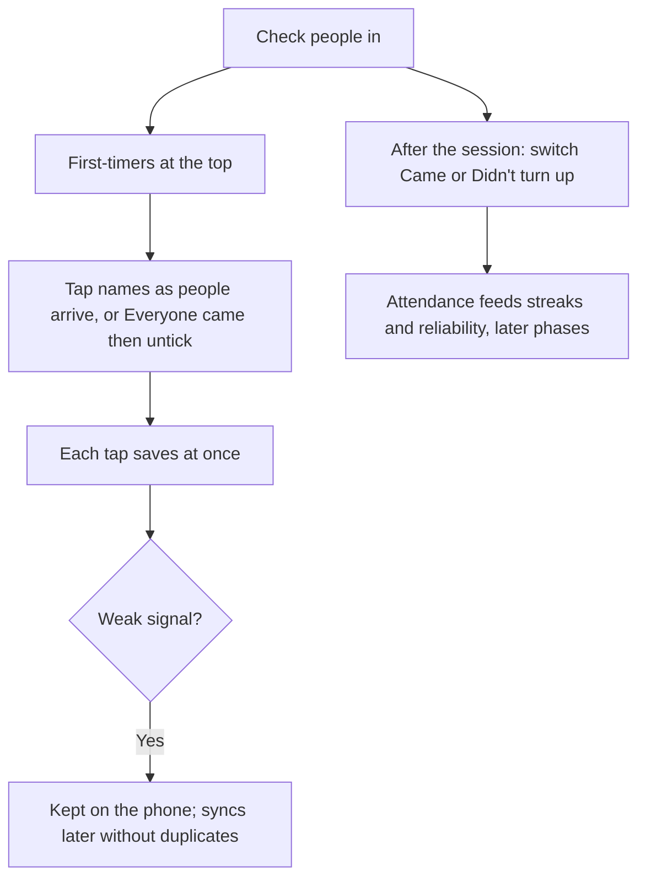
```mermaid
flowchart TD
    A[Check people in] --> B[First-timers at the top]
    B --> C[Tap names as people arrive, or Everyone came then untick]
    C --> D[Each tap saves at once]
    D --> E{Weak signal?}
    E -- Yes --> F[Kept on the phone; syncs later without duplicates]
    A --> G[After the session: switch Came or Didn't turn up]
    G --> H[Attendance feeds streaks and reliability, later phases]
```

### 2.6 Get paid (US-16, D47)

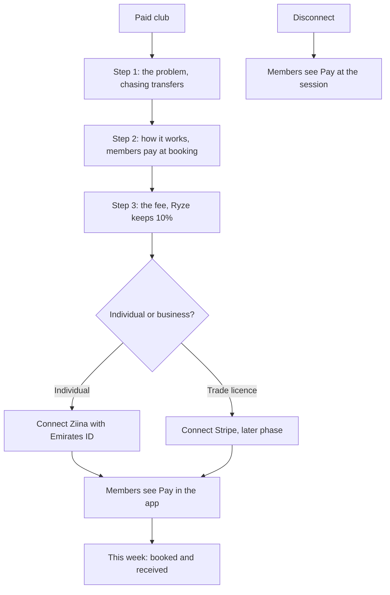
```mermaid
flowchart TD
    A[Paid club] --> B[Step 1: the problem, chasing transfers]
    B --> C[Step 2: how it works, members pay at booking]
    C --> D[Step 3: the fee, Ryze keeps 10%]
    D --> E{Individual or business?}
    E -- Individual --> F[Connect Ziina with Emirates ID]
    E -- Trade licence --> G[Connect Stripe, later phase]
    F --> H[Members see Pay in the app]
    G --> H
    H --> I[This week: booked and received]
    J[Disconnect] --> K[Members see Pay at the session]
```

### 2.7 Invite members (US-17, D35)

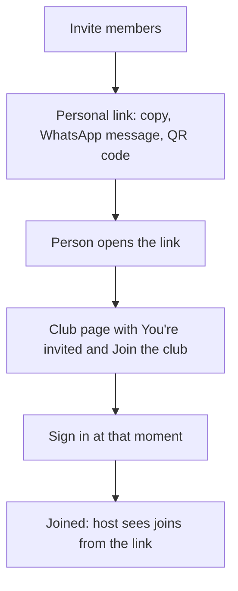
```mermaid
flowchart TD
    A[Invite members] --> B[Personal link: copy, WhatsApp message, QR code]
    B --> C[Person opens the link]
    C --> D[Club page with You're invited and Join the club]
    D --> E[Sign in at that moment]
    E --> F[Joined: host sees joins from the link]
```

### 2.8 Edit club details (US-18, D43)

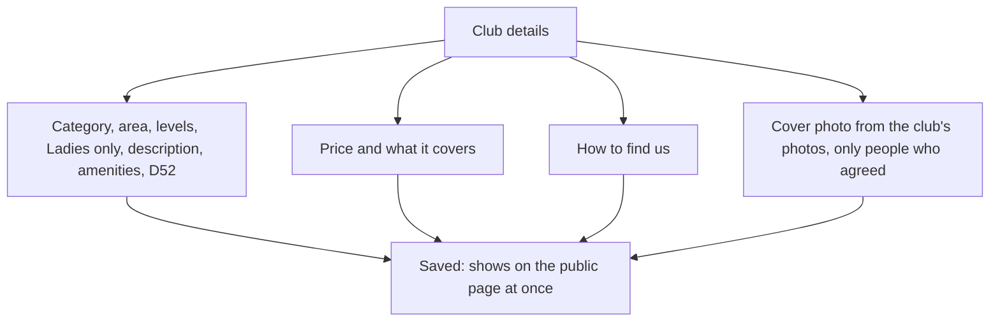
```mermaid
flowchart TD
    A[Club details] --> B[Category, area, levels, Ladies only, description, amenities, D52]
    A --> C[Price and what it covers]
    A --> D[How to find us]
    A --> E[Cover photo from the club's photos, only people who agreed]
    B --> F[Saved: shows on the public page at once]
    C --> F
    D --> F
    E --> F
```

### 2.9 Share the week (US-19) and co-organisers (US-20)

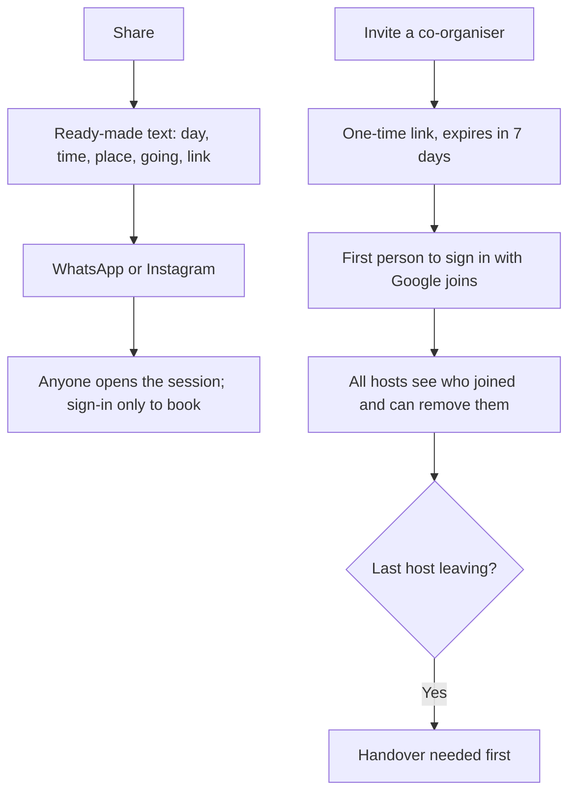
```mermaid
flowchart TD
    A[Share] --> B[Ready-made text: day, time, place, going, link]
    B --> C[WhatsApp or Instagram]
    C --> D[Anyone opens the session; sign-in only to book]
    E[Invite a co-organiser] --> F[One-time link, expires in 7 days]
    F --> G[First person to sign in with Google joins]
    G --> H[All hosts see who joined and can remove them]
    H --> I{Last host leaving?}
    I -- Yes --> J[Handover needed first]
```

## Board 3: Money

The rules (D47): members pay the host's price into the host's own Ziina account; Ryze keeps 10%; the host pays the card fee; Ryze never holds session money. Private games and events add AED 3 per guest (D48).

### M1. A member pays for a club session

How Ryze collects its 10% is still open, so both options are shown.

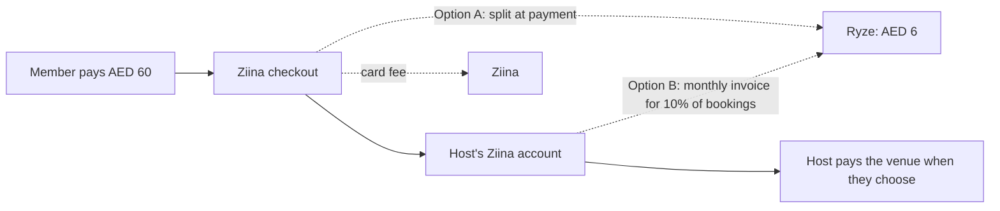
```mermaid
flowchart LR
    M[Member pays AED 60] --> P[Ziina checkout]
    P --> H[Host's Ziina account]
    P -. Option A: split at payment .-> R[Ryze: AED 6]
    H -. Option B: monthly invoice for 10% of bookings .-> R
    H --> V[Host pays the venue when they choose]
    P -. card fee .-> Z[Ziina]
```

### M2. The member cancels

```mermaid
flowchart TD
    A[Member cancels a paid booking] --> B{12 hours or more before?}
    B -- Yes --> C[Refund from the host's Ziina to the member]
    C --> D[Ryze's 10% returned, or left off the invoice]
    B -- No --> E[No refund: host keeps the payment, Ryze keeps 10%]
```

### M3. The host cancels a session

```mermaid
flowchart TD
    A[Host cancels a date] --> B[Every paid booking refunded in full]
    B --> C[Ryze's 10% returned]
    C --> D[Members told; streak protected, D28]
```

### M4. Free club

```mermaid
flowchart LR
    M[Member books] --> H[Free club]
    H -. no money moves .- R[Ryze earns nothing]
```

### M5. One-off workshop

Same as M1. Ryze keeps 10% of the ticket.

### M6. Private game or event: already paid (D48)

```mermaid
flowchart TD
    A[Host has paid the venue, e.g. 5-a-side pitch AED 400] --> B[Creates the event: share AED 40, private link]
    B --> C[Guests pay AED 40 + AED 3]
    C --> D[AED 40 each to the host's Ziina: host paid back]
    C --> E[AED 3 each to Ryze]
    D --> F{Guest drops out?}
    F -- Someone takes the spot --> G[Leaver refunded AED 40; Ryze keeps AED 3]
    F -- Nobody takes it --> H[No refund: paid means committed]
```

### M7. Private game or event: collect first (D48)

```mermaid
flowchart TD
    A[Host creates: share, minimum guests, pay-by date] --> B[Guests pay share + AED 3]
    B --> C{Minimum reached by the pay-by date?}
    C -- No --> D[Nobody charged, or everyone refunded in full]
    C -- Yes --> E[Host books and pays the venue from the shares]
    E --> F[Ryze keeps AED 3 per guest]
    G[Host cancels at any point] --> H[Everyone gets everything back]
```

### M8. Venue commission (parked idea 6)

```mermaid
flowchart LR
    V[Venue] -->|commission or lower rate for Ryze groups| R[Ryze]
    R -. never books or pays venues for groups .- V
```

### M9. Coaching (parked idea 4)

```mermaid
flowchart LR
    M[Client pays AED 250] --> C[Coach's account]
    C -. 15% .-> R[Ryze: AED 37.50]
```

## Board 4: Later phases

### 4.1 Ask to join and reliability (D49, D50)

```mermaid
flowchart TD
    A[Private event with Ask to join on] --> B[Person sends a profile: photo, work, area, Instagram, optional LinkedIn, attendance]
    B --> C[Host sees attendance and would host again answers added up]
    C --> D{Host approves?}
    D -- Yes --> E[Person pays: money flow M6 or M7]
    D -- No --> F[Request declined; nothing paid]
    E --> G[After the event: host answers Would you host them again?]
    G --> H[Added to the private reliability record]
```

### 4.2 Streaks (phase 2)

```mermaid
flowchart TD
    A[Host checks people in] --> B[Member marked Came]
    B --> C[Week counts for the streak]
    D[Club cancels a booked session] --> C
    C --> E{Milestone reached?}
    E -- Yes --> F[Milestone shown and shareable]
    G[A missed week] --> H{Rest week available?}
    H -- Yes --> I[Streak kept; rest week returns after 4 weeks]
    H -- No --> J[Streak resets]
```

## Open questions shown on the boards

- How Ryze collects its 10%: split at payment (Ziina) or monthly invoice (M1).
- Fee-free months for new hosts: not decided.
- Refund window: 12 hours (US-06). Hosts may want to choose their own.
