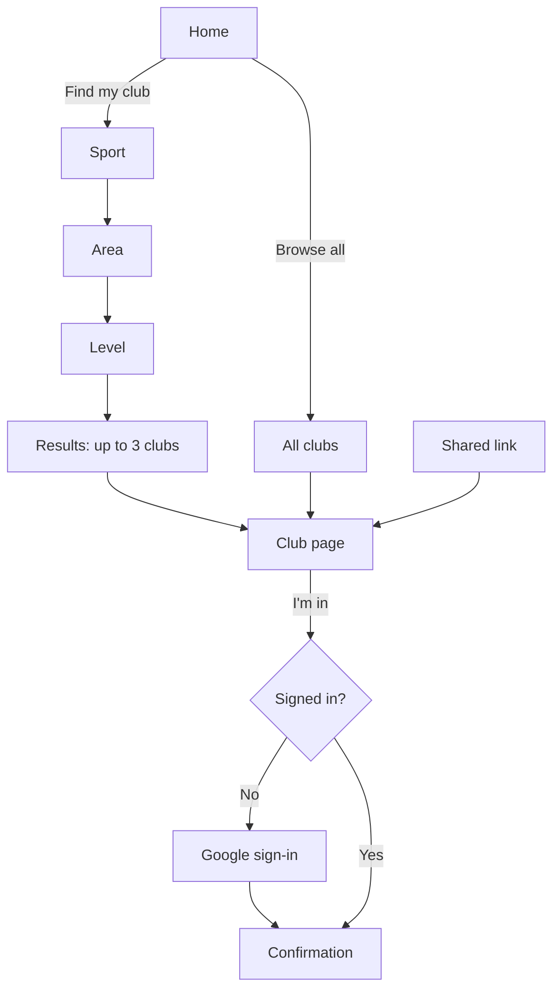

# UX-001 — Find a club and RSVP

## Readiness override

The PRD is handoff-ready. No PRD review exists; the founder chose to move straight to design on 2026-10-07. Visual direction comes from `explorations/explore-001-visual-direction.md` (the blend). No design system exists yet, so colours, type and components are not locked here.

## Slice

| | |
|---|---|
| **Actor** | Newcomer: new to Dubai or new to the sport, on a phone, not signed in |
| **Goal** | Find a club that suits them and commit to a first session |
| **Entry points** | (1) Home page. (2) A club page opened from a link on Instagram, WhatsApp or search |
| **Success** | An RSVP exists for a session, the person knows where and when to turn up, and a reminder is set |
| **Platforms** | Phone browser first (about 360–430 px wide). Tablet and desktop supported |

## Traceability

| PRD ID | Covered by |
|---|---|
| FR-1 Match quiz | Quiz, Results |
| FR-2 Browse and filter | All clubs |
| FR-3 Club page | Club page |
| FR-5 RSVP | Session bar, Session sheet, Sign-in, Confirmation |
| FR-6 Reminders (opt-in only) | Confirmation |
| FR-20 Report a listing (entry only) | Club page |
| UJ-1 | Main flow |

Reminder delivery, attendance and "My clubs" belong to UX-002. Photo posting belongs to UX-004.

## Surfaces

1. **Home** — one promise, one button to start the quiz, a link to browse all clubs.
2. **Quiz** — three questions, one per screen.
3. **Results** — up to three clubs with reasons.
4. **All clubs** — full list with filters.
5. **Club page** — public; photos first; session bar fixed at the bottom.
6. **Session sheet** — full details of one session; opens over the club page.
7. **Sign-in** — Google sign-in, shown only when needed.
8. **Confirmation** — RSVP confirmed; reminder choices; what to expect.

## Main flow (UJ-1)

1. **Home.** The person taps "Find my club".
2. **Quiz.** Sport, then area, then level. Tapping an answer moves to the next question; no "Next" button. A back arrow returns to the previous question with the answer kept. Progress shows "1 of 3".
   - Sport: Running, Padel, Yoga and pilates. One choice.
   - Area: Marina, JVC, Dubai Hills, Downtown, Jumeirah, Palm, Mirdif, or "Anywhere in Dubai". No location permission is requested.
   - Level: "New to it", "Some experience", "Regular".
3. **Results.** Up to three clubs. Each shows name, one photo, a plain reason ("Easy pace group · near Marina"), the next session and how many are going. Below: "See all running clubs".
4. **Club page.** Top to bottom: recent photos; name and one-line facts (sport, area, cost, beginners welcome); who's going next; description; weekly schedule; session recaps with photos; links to the club's Instagram and WhatsApp; "Last confirmed" date; "Report a problem with this page". The **session bar** stays at the bottom: next session day and time, place, "I'm in".
5. **Session sheet.** Tapping the bar's text (not the button) or any session in the schedule opens the sheet: date, time, exact meeting point, pace or level, distance or format, what to bring, count going, and "I'm in".
6. **RSVP.** Tapping "I'm in" when not signed in opens Sign-in with the line "Sign in to save your spot". After Google sign-in the RSVP is made without a second tap.
7. **Confirmation.** "You're in." Session summary, reminder choices, "Add to calendar", the club's WhatsApp link, and one line on what to expect at a first session.

## Alternate paths

- **Arrives on a club page from a link.** Flow starts at step 4. A small "Find other clubs" link leads to the quiz.
- **Already signed in.** Step 6 is skipped; the button changes to "You're going" at once.
- **Changes mind.** "You're going" opens the sheet with "Can't make it". One tap cancels; no confirmation dialog, with an "Undo" message for a few seconds.
- **Wants a different day.** Any session in the weekly schedule can be opened and RSVPed to.
- **Skips the quiz.** "Browse all clubs" from Home, with filters for sport, area, day and level.

## States

| State | Where | Behaviour |
|---|---|---|
| Loading | Results, club page | Layout placeholders in the shape of the content; the session bar appears first |
| No match | Results | "No clubs match all three yet." Show the nearest alternatives with the reason they differ ("15 minutes further", "Mixed level") |
| No clubs for a filter | All clubs | "Nothing on Fridays in JLT yet." Offer to clear the last filter |
| No upcoming session | Club page | Bar reads "No session scheduled". Button becomes "Follow this club" |
| Session full | Bar, sheet | "Full · 20 of 20". Button is replaced by "See next session" |
| Session cancelled | Bar, sheet | "Cancelled" label; the bar moves on to the following session |
| Session changed | Sheet | "Time changed" label with the old time struck through |
| Possibly out of date | Club page | Notice under the name: "This page hasn't been confirmed since 12 Aug. Check with the club before you go." |
| No photos yet | Club page | Photo area is replaced by a plain panel with the club's sport, area and next session. No empty grey boxes |
| Sign-in cancelled or failed | Sign-in | Return to the club page; RSVP not made; message "You're not signed in, so your spot isn't saved." |
| RSVP failed | Bar | Button returns to "I'm in"; message "That didn't save. Try again." |
| Offline | Any | Pages already open stay readable; "I'm in" shows "You're offline. Try again when you're connected." |
| Long content | Club name, description | Names wrap to two lines; descriptions show four lines with "Read more" |

Permission-denied and destructive confirmation do not apply to this slice.

## Who sees what

| | Visitor | Signed-in member |
|---|---|---|
| Club page, schedule, photos | Yes | Yes |
| Count of people going | Yes | Yes |
| First names and initials of people going | No, shown as "18 going" | Yes |
| RSVP | Leads to sign-in | Yes |

## Interaction rules

- The session bar is always visible on the club page and never covers the last line of content.
- One primary button per screen.
- The quiz never asks for an account, a name or a location permission.
- Quiz answers are remembered on the device so a return visit opens on results.
- An RSVP also adds the club to the person's clubs. [ASSUMPTION: U1]
- Photos open full-screen on tap and close with a swipe down or a close button.
- External links (Instagram, WhatsApp) open outside the site.

## Locked wording

| Place | Text |
|---|---|
| Home headline | Find your people. Keep showing up. |
| Home button | Find my club |
| Quiz questions | What gets you moving? · Where are you based? · How would you describe yourself? |
| Level answers | New to it · Some experience · Regular |
| Results heading | 3 clubs fit you (or "1 club fits you") |
| RSVP button | I'm in |
| After RSVP | You're going |
| Cancel | Can't make it |
| Sign-in prompt | Sign in to save your spot |
| Sign-in button | Continue with Google |
| Confirmation heading | You're in. |
| Reminder choice | Remind me by email (on by default) · Remind me on WhatsApp (asks for a phone number) |
| WhatsApp consent | We'll only message you about sessions you've joined. Turn it off any time. |
| First-timer line | First time? Arrive 10 minutes early and say hi to the organiser. |
| Freshness | Last confirmed by the organiser on 3 Oct |

## Responsive behaviour

- **Phone:** single column. Session bar fixed at the bottom. Session sheet slides up and covers most of the screen. Quiz answers are full-width.
- **Tablet and desktop:** club page uses two columns; the session details sit in a panel that stays in view on the right and replaces the bottom bar. The sheet becomes a centred dialog. Results show three clubs side by side.

## Accessibility

- Every step works by keyboard; quiz answers are a single-choice group with arrow-key movement.
- When a sheet or dialog opens, focus moves into it and returns to the button that opened it on close.
- After RSVP, "You're going" is announced to screen readers.
- Photos from members carry the caption as their description, or "Photo from Thursday's session" when there is none.
- Touch targets are at least 44 px. The session bar respects the phone's bottom safe area.
- No information is carried by colour alone: "Full", "Cancelled" and "Possibly out of date" are words.
- Motion for the sheet and quiz transitions is reduced when the device asks for it.
- English only, left to right. Contrast and type sizes are owed by the design system.

## Measurement the product needs to see

Quiz started and completed; results that lead to a club page; club page views by entry point (quiz, browse, link); RSVP taps; sign-ins completed; RSVPs made; WhatsApp opt-ins.

## Feature-specific visual guidance

- Photos are the first thing seen on a club page; the session bar is the second.
- The reason for each match is more prominent than the club's description.
- People going are shown as overlapping initials with a count, placed near the RSVP button.
- Notices ("Possibly out of date", "Cancelled") are calm and plain, never alarming.

## Architecture handoff

- Club pages and session details must be readable without an account and shareable by link, with a useful preview when pasted into WhatsApp or Instagram.
- The session bar's content should appear before photos finish loading.
- An RSVP started before sign-in must complete after sign-in without a second tap.
- "Going" counts should be current within about a minute.
- Capacity must be enforced so two people cannot take the last spot.
- Attendee names are never sent to visitors who are not signed in.
- Quiz answers are kept on the device only until sign-in.
- The match must return reasons in plain words, and the nearest alternatives when nothing fits.
- A phone number is collected only on WhatsApp opt-in.

## Assumptions

| ID | Assumption |
|---|---|
| U1 | An RSVP adds the club to the person's clubs automatically |
| U2 | One question per screen with automatic advance is quicker than one screen of chips |
| U3 | A chosen area is accurate enough without asking for location |
| U4 | Email reminders are on by default after sign-in; WhatsApp is opt-in |
| U5 | Visitors see a count of people going but no names |

## Open questions

None open.

Resolved by the founder on 2026-10-07:
- No waiting list in V1. A full session offers the next session.
- Launch areas: Marina, JVC, Dubai Hills, Downtown, Jumeirah, Palm, Mirdif, plus "Anywhere in Dubai".
- "Follow this club" is available on every club page without an RSVP. It asks for sign-in and adds the club to the person's clubs.

## Recommended PRD changes

- FR-4: state what happens when a session is full (no waiting list in V1).
- FR-3: add the "no photos yet" fallback, following the visual direction decision.

## Self-review

All in-scope PRD IDs are mapped. Success and failure paths, states, platforms, accessibility, visibility and handoff are covered. Not reviewed by anyone else. Status stays `draft`.

## Changelog

- 2026-10-07: created.
- 2026-10-07: waiting list, areas and follow resolved by the founder.
