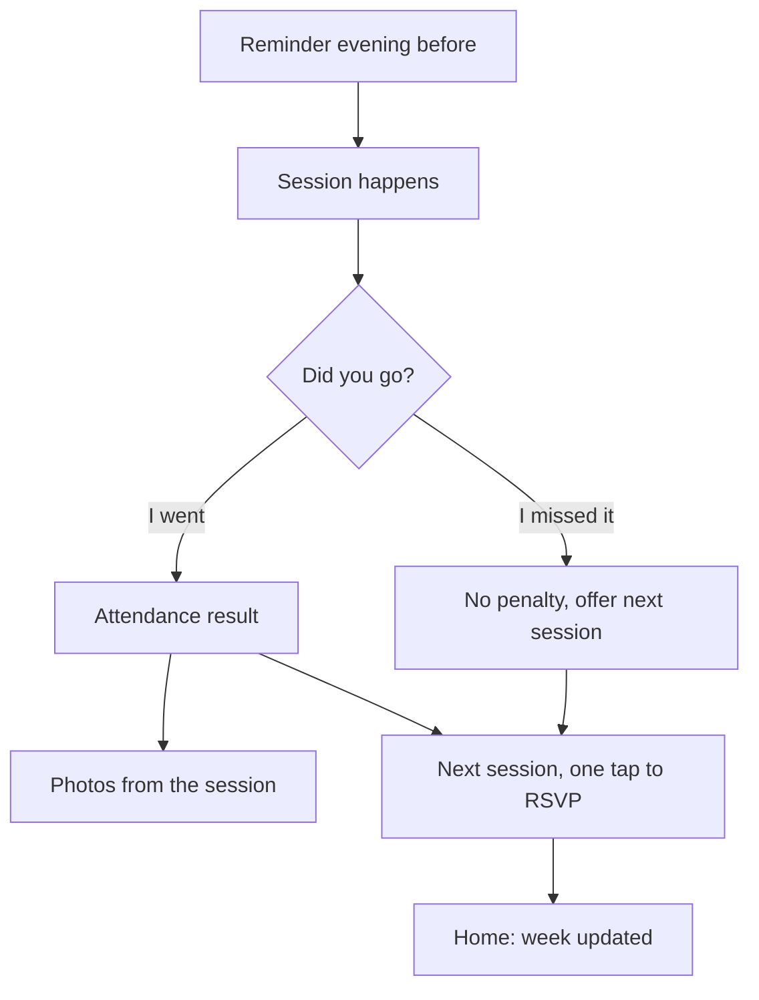

# UX-002 — Turn up and come back

## Readiness override

Same as UX-001 and UX-003: PRD handoff-ready, PRD review skipped by the founder, no design system yet.

## Slice

| | |
|---|---|
| **Actor** | Member: signed in, has RSVPed to a session or follows a club |
| **Goal** | Get to the session without having to remember it, record that they went, and line up the next one |
| **Entry points** | (1) A reminder by email or WhatsApp. (2) Home, "Coming up". (3) "My clubs". (4) A "Did you go?" message after a session |
| **Success** | Attendance is confirmed and the member has an RSVP for another session |
| **Platforms** | Phone browser first; messages read in email and WhatsApp. Tablet and desktop supported |

## Traceability

| PRD ID | Covered by |
|---|---|
| FR-4 Sessions (changed, cancelled) | Session notices, Coming up |
| FR-6 Reminders | Reminder, Message settings |
| FR-11 Attendance | "Did you go?", Attendance result |
| FR-13 Newcomer nudge | After "I went", Nudge message |
| FR-14 My clubs | My clubs, Coming up |
| UJ-2 | Main flow |

RSVP itself is in UX-001. What attendance does to the streak is in UX-003. Posting photos is in UX-004. Organiser corrections to attendance are in UX-005.

## Messages a member can receive

| Message | When | Channel |
|---|---|---|
| **Reminder** | Sessions starting before 10:00: at 19:00 the evening before. Later sessions: three hours before. One per session. [ASSUMPTION: T1] | Email, and WhatsApp if opted in |
| **Session changed** | As soon as the organiser changes time or place | Same |
| **Session cancelled** | As soon as the organiser cancels | Same |
| **Did you go?** | Two hours after the session's start time, only if the member has not already confirmed on the site. [ASSUMPTION: T2] | Same |
| **Next session nudge** | Two days after a newcomer's attended session, only if they have no RSVP with that club. Stops after their third attended session with the club. [ASSUMPTION: T3] | Same |
| **Streak at risk** | Defined in UX-003 | Same |

Rules for all messages:
- Only about sessions the member RSVPed to, or clubs they follow.
- Each has one link that opens the right page, already signed in on that device where possible.
- Reminders are not sent between 22:00 and 05:00. Changes and cancellations to a session starting within 12 hours are sent at any time.
- WhatsApp messages use fixed, pre-approved wording and say that replies are not read.

## Surfaces

1. **Coming up** — on Home: the member's next sessions across all clubs.
2. **My clubs** — clubs the member follows.
3. **Session sheet** — as in UX-001, with member actions.
4. **Did you go?** — a card on Home and a message.
5. **Attendance result** — what the member sees after answering.
6. **Message settings** — in Profile.

## Main flow (UJ-2)

1. **Reminder.** "Tomorrow 05:45 · Marina Dawn Runners · Marina Walk, by Pier 7 · 18 going." Links: "View session" and "Can't make it".
2. **Before the session.** On Home, the session sits at the top of "Coming up" marked "Going". Opening it shows the meeting point, a map link, who's going and "Add to calendar".
3. **After the session.** Two hours after the start, Home shows a card: "Did you go to Thursday's run?" with "I went" and "I missed it". The same question arrives as a message if the card has not been answered.
4. **I went.** The **Attendance result** shows, in order: the streak update or milestone (UX-003); photos from the session with "Add yours" (UX-004); the club's next session with "I'm in".
5. **Newcomer.** For a member's first three sessions with a club, the next-session offer is the most prominent item and reads "Same time next week?"
6. **Home** now shows the day marker filled and the next RSVP in "Coming up".

## Alternate paths

- **I missed it.** "No problem. Thursday's the next one." with "I'm in". It does not affect the member's milestones or standing with other members. The organiser can see it in their attendee list (UX-005).
- **Answered from the message.** Tapping "I went" in the email or WhatsApp message confirms attendance in one tap and opens the Attendance result.
- **Never answers.** The card stays on Home for seven days, then disappears. The session is treated as not attended. No further messages.
- **Changes the answer.** For seven days, the session sheet shows "You said you went" or "You said you missed it" with "Change".
- **Organiser has already marked attendance.** The card is not shown; Home goes straight to the result. If the organiser marked the member absent and the member disagrees, the sheet offers "I was there", which sends a note to the organiser.
- **Can't make it.** From the reminder or the sheet. One tap, with "Undo". The count of people going drops.
- **Session changed.** The session in "Coming up" shows "Time changed" with the old time struck through. The RSVP stays in place.
- **Session cancelled.** The session shows "Cancelled" and the club's next session is offered beneath. If the club cancels a session the member had RSVPed to and the member attends nothing else that week, the week still counts towards their streak and Home says "Thursday's run was cancelled. Your week still counts." It does not add to total sessions.
- **Follows a club, no RSVP.** The club's sessions appear in "Coming up" marked "RSVP". No reminders are sent for them.

## My clubs

- A list of followed clubs, each with its photo, sport, next session and the member's weeks attended there.
- Each row opens the club page.
- "Following" on a club page can be switched off. Unfollowing keeps history and existing RSVPs.
- At the end of the list: "Find another club", leading to the quiz with previous answers kept.

## States

| State | Where | Behaviour |
|---|---|---|
| Nothing coming up | Home | "Nothing booked. Your clubs have 4 sessions this week." with the list |
| No clubs followed | Home, My clubs | "Follow a club to see your week." with "Find my club" |
| Session today | Coming up | Marked "Today" and kept at the top until two hours after it starts |
| Several unanswered sessions | Home | One card at a time, oldest first, with "2 more to confirm" |
| Answer failed to save | Did you go? | "That didn't save. Try again." The card stays |
| Message link opened while signed out | Any | The action completes if the link is still valid; otherwise sign-in, then the action |
| Link older than seven days | Did you go? | "This one's closed. Here's what's coming up." |
| Reminders off | Message settings, session sheet | The sheet notes "Reminders are off" with a link to settings |
| WhatsApp number not confirmed | Message settings | "Confirm your number to get WhatsApp reminders." Email continues meanwhile |
| Offline | Home | Last known list with a "Last updated" time; answers are held and sent when back online |
| Loading | Home | "Coming up" appears before photos |

Permission-denied and destructive confirmation do not apply.

## Who sees what

| | Member | Other members | Organiser |
|---|---|---|---|
| That the member RSVPed | Yes | Yes, first name and initial | Yes |
| That the member attended | Yes | Only through standings and photos | Yes |
| That the member RSVPed and did not turn up | Yes | No | Yes, for their own club's sessions |
| The member's message settings and phone number | Yes | No | No |

## Interaction rules

- The member answers "Did you go?" with one tap. No form, no rating, no comment.
- Missing a session is never shown to other members and never described as a failure. The club's organiser can see it.
- The "Can't make it" link is offered in every reminder, so cancelling in advance is easier than not turning up.
- At most two messages relate to any one session: the reminder and "Did you go?". Changes and cancellations are extra and only sent when they happen.
- The next-session offer always names a real session with a day and time.
- Message settings are grouped by type, each with an email switch and a WhatsApp switch: session reminders, changes and cancellations, "Did you go?", next-session nudges, streak reminders.
- Turning off changes and cancellations shows one line of warning: "You might turn up to a cancelled session."

## Locked wording

| Place | Text |
|---|---|
| Reminder (evening before) | Tomorrow 05:45 · Marina Dawn Runners. Marina Walk, by Pier 7. 18 going. |
| Reminder (same day) | Today 19:00 · Al Quoz Padel Social. 12 going. |
| Changed | Time changed: Thursday's run now starts at 06:00. You're still in. |
| Cancelled | Thursday's run is cancelled. Next one: Saturday 06:30. |
| Did you go? | Did you go to Thursday's run? |
| Answers | I went · I missed it |
| After "I missed it" | No problem. Thursday's the next one. |
| Newcomer offer | Same time next week? |
| Nudge message | Marina Dawn Runners meet again Thursday 05:45. Want in? |
| WhatsApp footer | Replies here aren't read. Manage messages in your profile. |
| Dispute | I was there |
| Coming up labels | Going · RSVP · Today · Cancelled · Time changed |

## Responsive behaviour

- **Phone:** "Coming up" is a vertical list under the streak. The "Did you go?" card sits above everything else on Home while unanswered.
- **Tablet and desktop:** "Coming up" and "My clubs" share the right-hand column beside the streak; the card spans the top.
- **Messages:** readable without images; the key facts are in the first line so they show in a notification preview.

## Accessibility

- "I went" and "I missed it" are two clearly separate buttons of equal size, not a swipe.
- After answering, the result is announced: "Marked as attended. 7 week streak."
- Times are written in full for screen readers ("5:45 in the morning, Thursday 8 October").
- Session labels are words, never colour alone.
- Emails use real text and a single-column layout; links describe their action.
- Touch targets are at least 44 px. Contrast and sizes are owed by the design system.

## Measurement the product needs to see

Reminders sent and opened; RSVPs cancelled from a reminder; "Did you go?" answered on site versus from a message; share answering "I went"; second RSVP within 14 days of a first session (the PRD's main signal); nudges sent and the RSVPs that follow; reminder opt-outs by channel.

## Feature-specific visual guidance

- The unanswered "Did you go?" card is the most prominent thing on Home, above the streak, until answered.
- "Coming up" items show day and time first, then the club.
- On the Attendance result, the next-session offer is never below the fold on a phone.

## Architecture handoff

- Reminders, changes and cancellations must arrive on time; a late reminder for a 05:45 session is a failure.
- Links in messages must complete their action in one tap, stay valid for seven days, and work only for the member they were sent to.
- Attendance records how it was confirmed (member, organiser, or message link) and can be changed for seven days.
- An organiser's mark takes precedence over a member's answer; a dispute is passed to the organiser.
- A session's timing rules use Dubai time.
- WhatsApp messages are limited to pre-approved wording and require a confirmed number and opt-in.
- A member is never sent messages about a session after cancelling their RSVP.
- Answers given offline are held and sent later without duplicates.
- Who missed a session is never exposed to other members.

## Assumptions

| ID | Assumption |
|---|---|
| T1 | The evening before is the right time to remind people about early-morning sessions |
| T2 | Two hours after the start is late enough that most sessions have finished |
| T3 | Three sessions is where a newcomer becomes a regular, so nudges stop there |
| T4 | One-tap confirmation from a message is acceptable for badges and streaks in V1, though too weak for rewards later |

## Open questions

- Should "Did you go?" also ask "How was it?" later, to give clubs feedback? Left out of V1.

Resolved by the founder on 2026-10-07:
- Organisers see who RSVPed and did not turn up.
- 19:00 the evening before is confirmed for early sessions (T1 confirmed).
- A week counts when the member's RSVPed session was cancelled by the club.

## Recommended PRD changes

Applied to the PRD on 2026-10-07: FR-6 reminder timing, FR-11 changing and disputing attendance, FR-12 cancelled-session rule, FR-17 no-shows.

## Self-review

All in-scope PRD IDs are mapped. Success and failure paths, states, visibility, platforms, accessibility and handoff are covered. Not reviewed by anyone else. Status stays `draft`.

## Changelog

- 2026-10-07: created.
- 2026-10-07: no-shows visible to organisers, reminder timing and cancelled-session rule confirmed by the founder.
